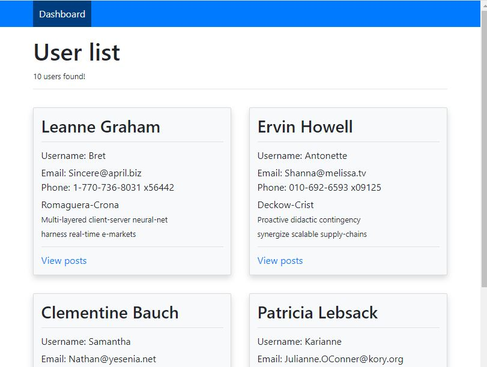
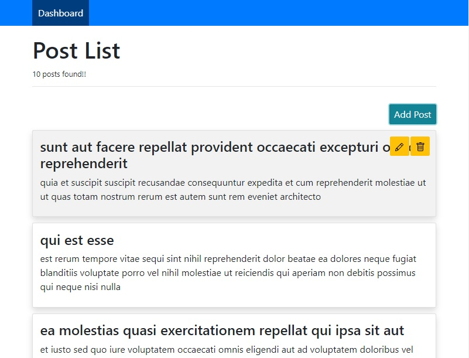
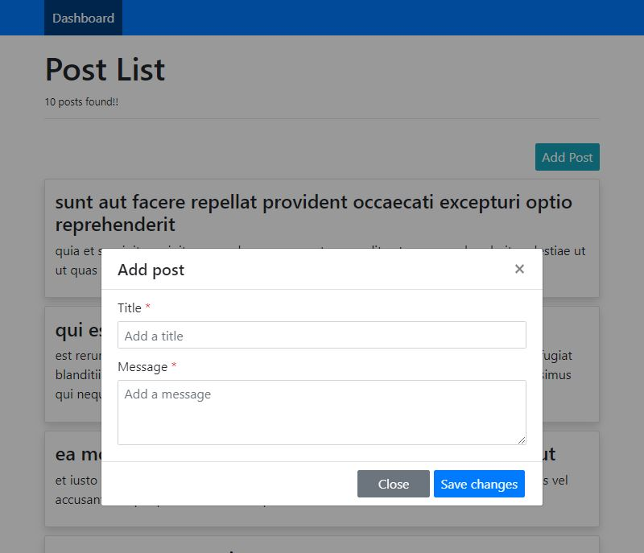
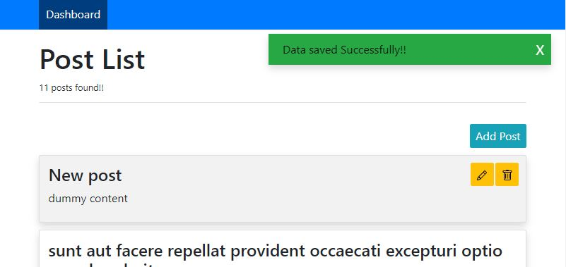
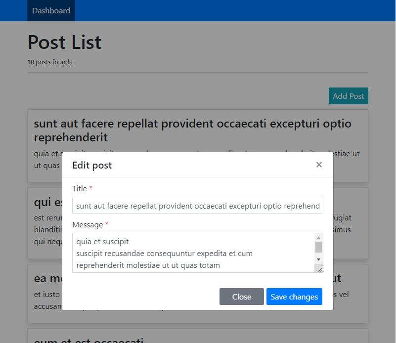
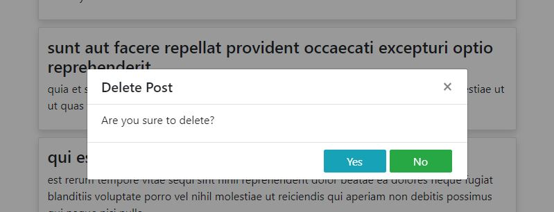
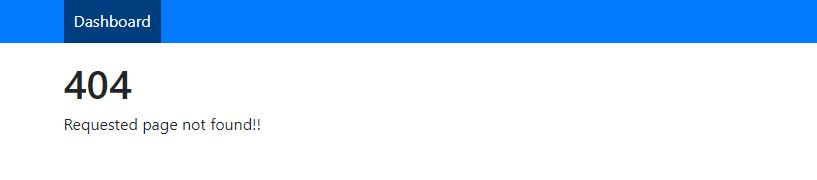

# Angular Simple C(reate)R(ead)U(pdate)D(elete)

A simple read write operation to show absolute beginners a way to Angular 10.

This project was generated with [Angular CLI](https://github.com/angular/angular-cli) version 10.0.6.


## Table of Contents

- [Tech-Stack](#tech-stack)
- [Technical Approach](#technical-approach)
  - [Folder Structure and Usage](#folder-structure-and-usage)
  - [Data Fetch](#data-fetch)
  - [Error Handling](#error-handling)
  - [Loader and Message Components](#loader-and-message-components)
- [Component Structure](#component-structure)
- [Application Preview](#application-preview)
  - [Home Page](#home-page)
  - [Post List Page](#post-list-page)
  - [Page Not Found](#page-not-found)


## Tech-Stack
- Angular 10.x 
- Bootstrap 4.x
- [jsonplaceholder](https://jsonplaceholder.typicode.com/) for backend API


## Technical Approach
Have not taken any modular approach as it is a really small application and it will be over-engineered if I modularize it :smile:
### Folder Structure and Usage
- For small application it is always preferred to make component structure according to page structure
- for header, footer, loader, messages, modal I have created shared folder
- child components are view only types with `ChangeDetectionStrategy.OnPush` for optimum performance.
- parent components are responsible for side effects

### Data Fetch
- for home page data fetch I have used resolvers to provide data on navigation complete and the data will be already present there to show the user list
- for edit dialogue show, didn't trigger any API call as I already have the details in parent component
- for post data fetch again used the resolver to make the data available at the time of component loading

### Error Handling
- for HTTP error handling I have used an interceptor which also starts the loader when an API is being called and stops loader when API call results in success or failure. For failure it will show proper error message.

### Loader and Message Components
- created a simple loader with CSS animation it will be triggered on route change and http call.
- it keeps a counter into it so that if multiple action triggers loader then it will show loading animation till all are not resolved.
- created a simple toast message component to show success, info, warning or error type messages.

## Component Structure

```
app/
  components
  dashboard/
    users/
      user.component.html
      user.component.ts
    dashboard.component.html
    dashboard.component.ts
  page-not-found/
    page-not-found.component.html
    page-not-found.component.ts
  posts/
    add-edit/
      add-edit.component.html
      add-edit.component.ts
    listing/
      listing.component.html
      listing.component.ts
    posts.component.html
    posts.component.ts
  shared/
    footer/
      footer.component.html
      footer.component.ts
    header/
      header.component.html
      header.component.scss
      header.component.ts
    loader/
      loader.component.html
      loader.component.scss
      loader.component.ts
      loader.service.ts
    messages/
      messages.component.html
      messages.component.scss
      messages.component.ts
      messages.service.ts
    modal/
      modal.component.html
      modal.component.scss
      modal.component.ts
```

## Application Preview
The application is to demonstrate a simple CRUD operation maintaining some industry standard procedures.

### Home Page
Home page consists of a user list fetched from the **jsonplaceholder** site. I have used this fake online REST API for prototyping purpose. On clicking on the **view post** link on users cards it will go to the post listing page.
Below is a snip from home page.



### Post List Page
This page is for listing the all posts of a particular user. 
- On hovering or focusing on the post cards the edit (pencil icon) and delete (trash icon) buttons will be visible.



- On clicking on add button a modal will appear to take user input to take the user post. On success full add it will show a success message on right top of page.





- Edit also you will see the edited content will appear in list and a success message after edit



- On clicking on the delete button a popup will appear to get the confirmation from user before delete



### Page Not Found
- last but not the least it has a 404 not found page




**NOTE:** JSONPLACEHOLDER PROVIDES BUNCH OF FAKE APIS. SO, THE POSTS ARE NOT ACTUALLY GETTING ADDED OR EDITED OR DELETED INTO/FROM SERVER, ON REFRESH YOUR CHANGES WILL BE RESET
